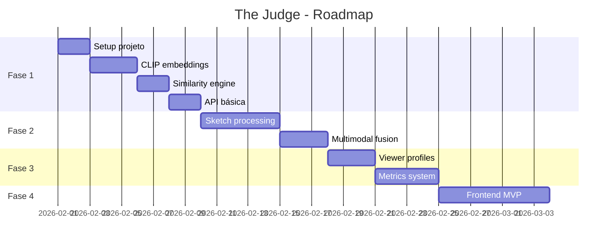

# The Judge - Plano de Implementação

> **Versão:** 1.0  
> **Data:** 2026-02-01  
> **Status:** Em desenvolvimento (Fase 1 completada)

---

## Visão Geral

Sistema de julgamento automatizado para Visão Remota Associativa (ARV) utilizando IA para eliminar viés humano na avaliação de sessões.

---

## Fase 1: Prova de Conceito (MVP)

**Objetivo:** Validar o core do sistema com CLIP para embeddings de texto/imagem.

### 1.1 Estrutura do Projeto

```
the-judge/
├── docs/                    # Documentação
│   ├── brainstorm_pesquisa.md
│   └── implementation_plan.md
├── src/
│   ├── core/               # Lógica principal
│   │   ├── embeddings.py   # Gerenciamento de embeddings
│   │   ├── similarity.py   # Cálculo de similaridade
│   │   └── judge.py        # Motor de julgamento
│   ├── models/             # Schemas e tipos
│   │   ├── session.py      # Sessão de visualização
│   │   ├── target.py       # Alvos (imagens)
│   │   └── viewer.py       # Perfil do visualizador
│   └── api/                # REST API
│       └── routes.py
├── tests/
├── data/
│   └── targets/            # Banco de imagens-alvo
├── requirements.txt
└── README.md
```

### 1.2 Componentes MVP

| Componente | Descrição | Status |
|------------|-----------|--------|
| **CLIP Embeddings** | Gerar vetores de texto e imagem | ✅ Feito |
| **Similarity Engine** | Calcular distância de cosseno | ✅ Feito |
| **Session Input** | Receber texto descritivo | ✅ Feito (API) |
| **Target Management** | Cadastrar pares de alvos | ✅ Feito (Supabase) |
| **Basic Judge** | Comparar sessão vs. alvos | ✅ Feito |

### 1.3 Tecnologias MVP

```python
# requirements.txt (MVP)
torch>=2.0
transformers>=4.35
open-clip-torch>=2.24
pillow>=10.0
numpy>=1.24
fastapi>=0.109
uvicorn>=0.27
```

---

## Fase 2: Processamento de Esboços

**Objetivo:** Adicionar capacidade de processar desenhos dos visualizadores.

### 2.1 Componentes

| Componente | Descrição |
|------------|-----------|
| **Sketch Encoder** | Sketchformer ou Quick, Draw! model |
| **Sketch Preprocessing** | Binarização, normalização |
| **Multimodal Fusion** | Combinar embeddings de texto + esboço |

### 2.2 Integração

```
Texto → CLIP Text Encoder → Embedding_T
Esboço → Sketch Encoder → Embedding_S
                        ↓
            Fusion (weighted avg ou attention)
                        ↓
                 Embedding_Final
```

---

## Fase 3: Sistema de Scoring de Visualizadores

**Objetivo:** Implementar tracking de performance individual.

### 3.1 Componentes

| Componente | Descrição |
|------------|-----------|
| **Viewer Profile** | Cadastro e histórico |
| **Metrics Calculator** | Hit rate, displacement, specialties |
| **Weighted Predictions** | Ponderar por performance |
| **Pattern Detection** | Alertas de displacement/declínio |

### 3.2 Database Schema

```sql
-- Viewers
CREATE TABLE viewers (
    id UUID PRIMARY KEY,
    username VARCHAR(100) UNIQUE,
    created_at TIMESTAMP DEFAULT NOW()
);

-- Sessions
CREATE TABLE sessions (
    id UUID PRIMARY KEY,
    viewer_id UUID REFERENCES viewers(id),
    event_id UUID,
    text_input TEXT,
    sketch_path VARCHAR(255),
    prediction_target CHAR(1),  -- 'A' ou 'B'
    confidence FLOAT,
    actual_result CHAR(1),      -- NULL até resultado
    created_at TIMESTAMP DEFAULT NOW()
);

-- Viewer Stats (materialized/cached)
CREATE TABLE viewer_stats (
    viewer_id UUID PRIMARY KEY REFERENCES viewers(id),
    total_sessions INT,
    hit_rate FLOAT,
    displacement_rate FLOAT,
    calibration_score FLOAT,
    updated_at TIMESTAMP
);
```

---

## Fase 4: Interface Web

**Objetivo:** Interface para visualizadores e administradores.

### 4.1 Páginas

| Página | Função |
|--------|--------|
| `/session/new` | Criar nova sessão (texto + desenho) |
| `/session/:id` | Ver resultado da sessão |
| `/viewer/profile` | Dashboard pessoal |
| `/admin/events` | Gerenciar eventos/alvos |
| `/admin/results` | Ver resultados agregados |

### 4.2 Tech Stack Frontend

- **Next.js 14** - Framework React
- **TailwindCSS** - Estilização
- **Canvas API** - Captura de esboços
- **Zustand** - State management

---

## Fase 5: Crowdsourcing e Agregação

**Objetivo:** Suportar múltiplos visualizadores por evento com predição ponderada.

### 5.1 Componentes

| Componente | Descrição |
|------------|-----------|
| **Event System** | Criar eventos com deadline |
| **Aggregator** | Combinar predições com pesos |
| **Confidence Intervals** | Calcular incerteza da predição |

---

## Roadmap



---

## Critérios de Sucesso

### MVP (Fase 1)
- [ ] Comparar texto com 2 imagens e retornar scores
- [ ] Acurácia ≥ julgamento humano em dataset de teste
- [ ] Latência < 2s por sessão

### Produção (Fase 4+)
- [ ] Suportar 100+ visualizadores
- [ ] Interface web funcional
- [ ] Tracking histórico completo
- [ ] API documentada (OpenAPI)

---

## Próximo Passo

**Iniciar Fase 2**: Desenvolvimento do Frontend (Next.js) e integração com a API existente.

```bash
# Comandos sugeridos
npx create-next-app@latest frontend
```
